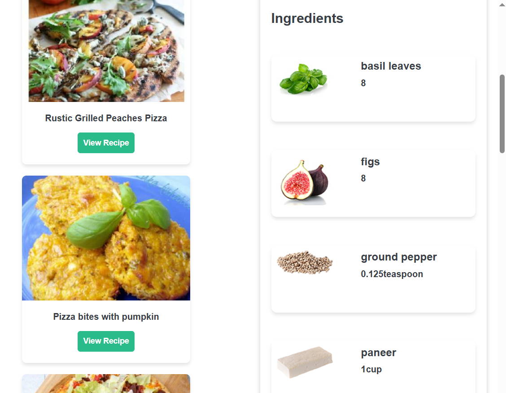

# Food Recipe App

A modern, responsive web app for discovering and viewing food recipes built with [insert tech stack, e.g. React.js, CSS, Spoonacular API etc.].

##  Table of Contents

- [About](#about)  
- [Features](#features)  
- [Screenshot](#screenshot)  
- [Getting Started](#getting-started)  
  - [Prerequisites](#prerequisites)  
  - [Installation](#installation)  
- [Usage](#usage)  
- [Project Structure](#project-structure)  
- [Technologies](#technologies)  
- [Future Improvements](#future-improvements)  

## About

The Food Recipe App allows users to browse a variety of recipes, view full recipe details (ingredients, instructions, images), and search for recipes by name or category. It’s a clean, beginner-friendly project aimed at demonstrating front-end development, API integration, and responsive design.

## Features

- Browse a list/grid of recipes  
- Search for recipes by keyword or filter by category  
- View recipe details: title, image, ingredients, instructions  
- Responsive design (desktop & mobile)  
- API integration (e.g., using the Spoonacular recipes API)  
- Clean UI with intuitive user experience  

## Screenshot

Here’s how the app looks in action:

  
  
  

## Getting Started

### Prerequisites

Make sure you have the following installed:

- Node.js (version X.X.X or higher)  
- npm (or yarn)  

Optionally:

- A free API key from Spoonacular (or whichever recipe API you’re using)  

### Installation

1. Clone the repository  
   ```bash
   git clone https://github.com/WaruniGunasena/Food-Recipe-App.git
   cd Food-Recipe-App
````

2. Install dependencies

   ```bash
   npm install
   # or
   yarn install
   ```
3. Create a `.env` file (if required) and add your API key

   ```
   REACT_APP_API_KEY=your_api_key_here
   ```
4. Start the development server

   ```bash
   npm start
   # or
   yarn start
   ```
5. Open your browser and go to `http://localhost:3000` (or whatever port your setup uses)
````
## Usage

* On the main page you’ll see a list of recipes.
* Use the search bar (or filter) to find a recipe by name or category.
* Click on a recipe card's view recipe button to view its detailed page (title, big image, ingredients list, cooking instructions).
* On mobile, the layout adjusts to fit smaller screens.

## Project Structure

```
Food-Recipe-App/
│
├─ src/
│   ├─ components/            # React components (e.g., RecipeList, RecipeCard, RecipeDetails, SearchBar)
│   ├─ screenshots/  
│   ├─ styles/                # CSS/SCSS files
│   ├─ App.js                 # main App component & routing
│   └─ index.js               # React root rendering
├─ .env                      # environment variables (not checked into git)
├─ package.json  
└─ README.md                 # this file
```

## Technologies

* React (hooks)
* CSS Styled-modules
* Fetch API  requests
* Responsive design (Flexbox/Grid)
* Recipe API (Spoonacular or similar)

## Future Improvements

Here are some ideas to enhance the app:

* Add user authentication (login/signup) and ability to save favorite recipes
* Add categories/tags & filtering (e.g., vegan, gluten-free)
* Add pagination or infinite scroll for large result sets
* Improve UI/UX: animations, dark mode toggle, skeleton loaders
* Add recipe upload (if backend implemented)
* Add tests (unit + integration)
* Convert to a full-stack app: backend (Node.js/Express) + database (MongoDB/PostgreSQL) + deploy
